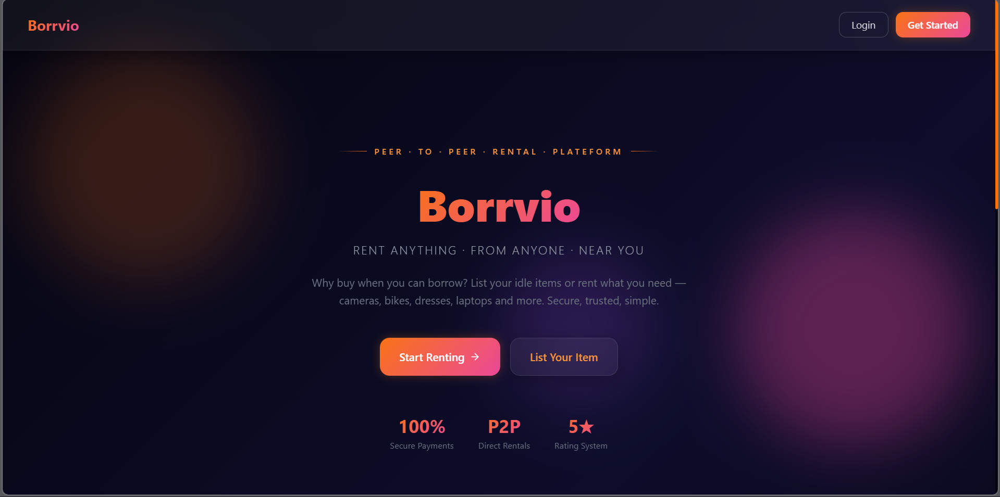
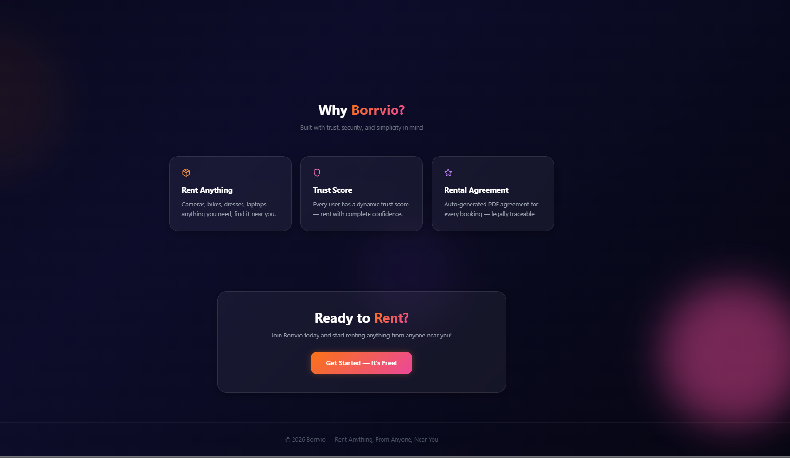
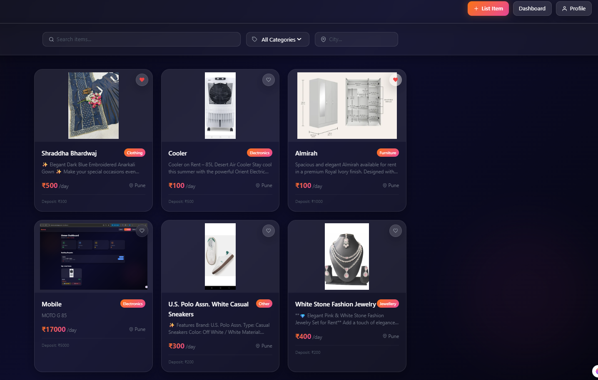
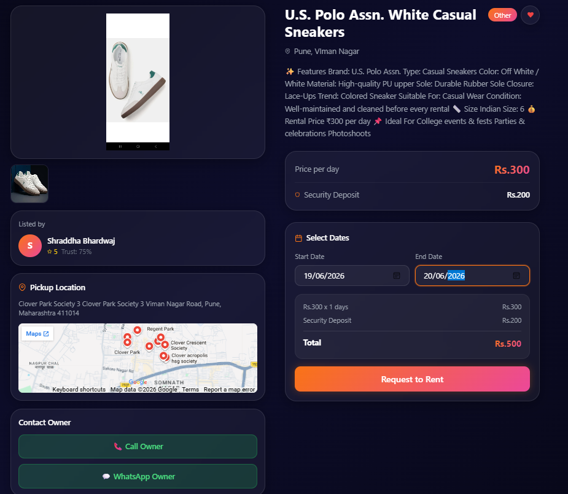
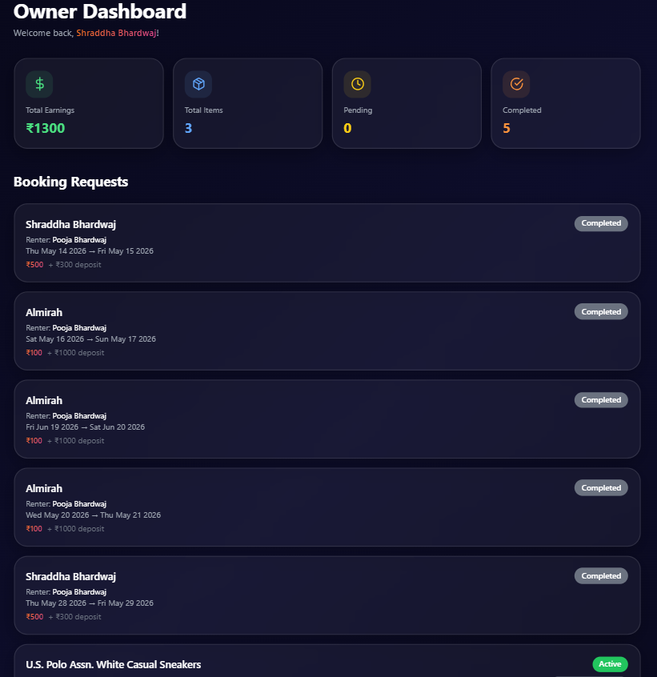
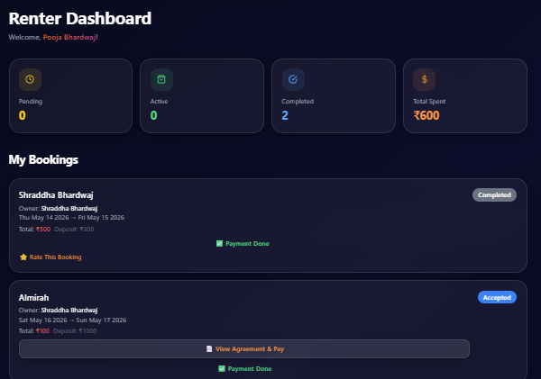
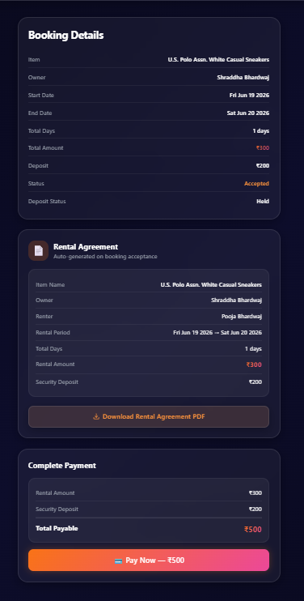
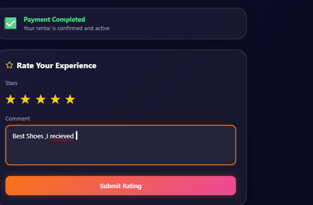

<div align="center">

# 🚀 Borrvio

### Peer-to-Peer Rental Marketplace

_"Rent Anything, From Anyone, Near You"_

[](https://reactjs.org/)
[](https://nodejs.org/)
[](https://expressjs.com/)
[](https://mongodb.com/)
[](https://tailwindcss.com/)
[](https://vercel.com/)
[](https://render.com/)
[](https://www.mongodb.com/atlas)

---

🌐 **[Live Demo](https://borrvio.vercel.app)** &nbsp;|&nbsp; 📂 **[GitHub Repo](https://github.com/bhardwajshraddha/borrvio)**

</div>

---

## 📌 About

**Borrvio** is a full-stack peer-to-peer rental marketplace where anyone can list their personal items for rent and anyone can rent what they need from people around them.

> **Why Borrvio?** India has no general-purpose P2P rental platform. People buy expensive items, use them once, and they sit idle. Others need the same items temporarily but can't justify buying them. Borrvio connects both — safely, securely, and affordably.

---

## 🖥️ Screenshots

### Home Page




### Browse Items



### Item Detail



### Owner Dashboard



### Renter Dashboard



### Booking Detail + Agreement



### Razorpay Payment



---

## ✨ Features

- 🔐 **JWT Authentication** — Secure login with bcrypt password encryption
- 👤 **Dual Role System** — One account acts as both Owner and Renter
- 📦 **Item Listing** — Multiple image upload via Cloudinary
- 🔍 **Search & Filter** — Search by name, filter by category and city
- ❤️ **Wishlist** — Save items for later with heart button
- 📅 **Booking Lifecycle** — Requested → Accepted → Active → Completed → Cancelled
- 🚫 **Date Conflict Detection** — Prevents double bookings automatically
- 💳 **Razorpay Payment** — Secure payment with HMAC SHA256 verification
- 📄 **Auto PDF Agreement** — Generated on booking acceptance with unique ID
- ⭐ **Dual Rating System** — Both owner and renter rate each other
- 🛡️ **Trust Score** — Dynamic score based on ratings and history
- 📧 **Email Notifications** — Booking updates via Resend API
- 🗺️ **Google Maps** — Pickup location on item detail page
- 📞 **Call + WhatsApp** — Direct contact with owner
- 🔑 **Forgot Password** — Secure reset via email link
- 📊 **Dashboards** — Analytics for Owner and Renter
- 🎨 **Glass Morphism UI** — Premium dark theme design
- 📱 **Fully Responsive** — Works on mobile, tablet, desktop

---

## 🛠️ Tech Stack

| Layer              | Technology                              |
| ------------------ | --------------------------------------- |
| **Frontend**       | React.js + Tailwind CSS + Framer Motion |
| **Backend**        | Node.js + Express.js                    |
| **Database**       | MongoDB + Mongoose                      |
| **Authentication** | JWT + bcrypt                            |
| **Payment**        | Razorpay (Test Mode)                    |
| **Image Storage**  | Cloudinary                              |
| **PDF Generation** | pdfkit                                  |
| **Email Service**  | Resend API                              |
| **Deployment**     | Vercel + Render + MongoDB Atlas         |

---

## 📁 Project Structure

```
borrvio/
├── client/                   # React Frontend
│   ├── public/
│   └── src/
│       ├── pages/
│       │   ├── Home.js
│       │   ├── Login.js
│       │   ├── Register.js
│       │   ├── Browse.js
│       │   ├── ItemDetail.js
│       │   ├── AddItem.js
│       │   ├── OwnerDashboard.js
│       │   ├── RenterDashboard.js
│       │   ├── BookingDetail.js
│       │   ├── Profile.js
│       │   ├── ForgotPassword.js
│       │   └── ResetPassword.js
│       └── App.js
│
└── server/                   # Node.js Backend
    ├── config/
    │   ├── db.js
    │   ├── cloudinary.js
    │   └── emailConfig.js
    ├── controllers/
    ├── middleware/
    ├── models/
    ├── routes/
    └── index.js
```

---

## 🔗 API Endpoints

Base URL: `https://borrvio.onrender.com/api`

### 🔐 Authentication

| Method | Endpoint                      | Description       | Auth |
| ------ | ----------------------------- | ----------------- | ---- |
| POST   | `/auth/register`              | Register new user | ❌   |
| POST   | `/auth/login`                 | Login user        | ❌   |
| GET    | `/auth/profile`               | Get profile       | ✅   |
| PUT    | `/auth/profile`               | Update profile    | ✅   |
| POST   | `/auth/forgot-password`       | Send reset email  | ❌   |
| POST   | `/auth/reset-password/:token` | Reset password    | ❌   |

### 📦 Items

| Method | Endpoint            | Description         | Auth |
| ------ | ------------------- | ------------------- | ---- |
| GET    | `/items`            | Get all items       | ❌   |
| GET    | `/items/:id`        | Get single item     | ❌   |
| POST   | `/items`            | Add item            | ✅   |
| PUT    | `/items/:id`        | Update item         | ✅   |
| DELETE | `/items/:id`        | Delete item         | ✅   |
| PATCH  | `/items/:id/toggle` | Toggle availability | ✅   |

### 📅 Bookings

| Method | Endpoint          | Description     | Auth |
| ------ | ----------------- | --------------- | ---- |
| POST   | `/bookings`       | Create booking  | ✅   |
| PUT    | `/bookings/:id`   | Update status   | ✅   |
| GET    | `/bookings/my`    | Renter bookings | ✅   |
| GET    | `/bookings/owner` | Owner bookings  | ✅   |

### 💳 Payments

| Method | Endpoint                | Description    | Auth |
| ------ | ----------------------- | -------------- | ---- |
| POST   | `/payment/create-order` | Create order   | ✅   |
| POST   | `/payment/verify`       | Verify payment | ✅   |

### ⭐ Ratings

| Method | Endpoint           | Description   | Auth |
| ------ | ------------------ | ------------- | ---- |
| POST   | `/ratings`         | Submit rating | ✅   |
| GET    | `/ratings/:userId` | Get ratings   | ❌   |

### 📄 Agreements

| Method | Endpoint                 | Description   | Auth |
| ------ | ------------------------ | ------------- | ---- |
| POST   | `/agreements/:bookingId` | Generate PDF  | ✅   |
| GET    | `/agreements/:bookingId` | Get agreement | ✅   |

### 📊 Dashboard

| Method | Endpoint            | Description  | Auth |
| ------ | ------------------- | ------------ | ---- |
| GET    | `/dashboard/owner`  | Owner stats  | ✅   |
| GET    | `/dashboard/renter` | Renter stats | ✅   |

### 🖼️ Upload + Wishlist

| Method | Endpoint            | Description          | Auth |
| ------ | ------------------- | -------------------- | ---- |
| POST   | `/upload`           | Upload images        | ✅   |
| POST   | `/wishlist`         | Add to wishlist      | ✅   |
| GET    | `/wishlist`         | Get wishlist         | ✅   |
| DELETE | `/wishlist/:itemId` | Remove from wishlist | ✅   |

---

## ⚙️ Local Setup

### Prerequisites

- Node.js v18+
- MongoDB (local or Atlas)
- Cloudinary account
- Razorpay account (test mode)
- Resend account

### Clone Repository

```bash
git clone https://github.com/bhardwajshraddha/borrvio.git
cd borrvio
```

### Backend Setup

```bash
cd server
npm install
```

Create `.env` in server folder:

```env
MONGO_URI=your_mongodb_uri
JWT_SECRET=your_jwt_secret
PORT=5000
CLOUDINARY_CLOUD_NAME=your_cloud_name
CLOUDINARY_API_KEY=your_api_key
CLOUDINARY_API_SECRET=your_api_secret
RAZORPAY_KEY_ID=your_razorpay_key
RAZORPAY_KEY_SECRET=your_razorpay_secret
RESEND_API_KEY=your_resend_key
FRONTEND_URL=http://localhost:3000
```

```bash
npm run dev
```

### Frontend Setup

```bash
cd client
npm install
npm start
```

---

## 🗄️ Database Collections

| Collection     | Purpose                        |
| -------------- | ------------------------------ |
| **Users**      | Auth, trust score, ratings     |
| **Items**      | Listings, images, availability |
| **Bookings**   | Lifecycle, payment, damage     |
| **Ratings**    | Dual rating system             |
| **Agreements** | PDF URLs, agreement details    |
| **Wishlist**   | Saved items                    |

---

## 🚀 Deployment

| Platform      | Purpose       | URL                          |
| ------------- | ------------- | ---------------------------- |
| Vercel        | Frontend      | https://borrvio.vercel.app   |
| Render        | Backend API   | https://borrvio.onrender.com |
| MongoDB Atlas | Database      | Cloud Hosted                 |
| Cloudinary    | Images + PDFs | CDN Hosted                   |

---

## 🔮 Future Enhancements

- 📍 Location-based filtering using Haversine formula
- 💳 Real money payments — Razorpay production keys
- 📱 React Native mobile app
- 🔐 KYC identity verification
- ☁️ AWS EC2 migration
- 👨‍💼 Admin panel
- 💬 In-app chat between owner and renter

---

## 👩‍💻 Author

**Shraddha Bhardwaj**

[](https://www.linkedin.com/in/shraddhabhardwaj/)
[](https://github.com/bhardwajshraddha)

---

## 📄 License

This project is for educational purposes — MCA Final Year Project.

---

<div align="center">
Made with ❤️ by Shraddha Bhardwaj
</div>
